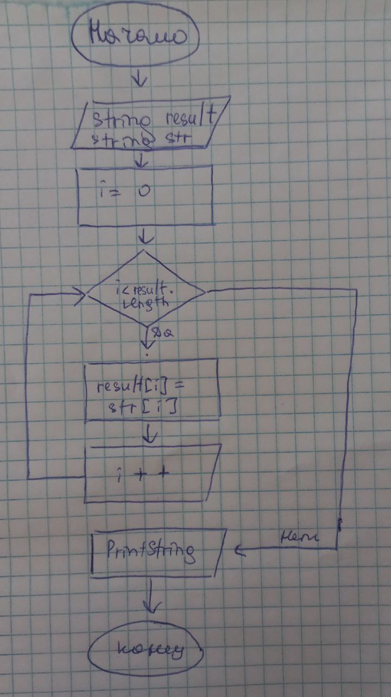

# Задача
Написать программу, которая из имеющегося массива строк формирует новый массив из строк, длина которых меньше, либо равна 3 символам. Первоначальный массив можно ввести с клавиатуры, либо задать на старте выполнения алгоритма. При решении не рекомендуется пользоваться коллекциями, лучше обойтись исключительно массивами.

# Решение
## Алгоритм решения
* Задать количество элементов в новом массиве.
* Создать новый массив.
* Задать имеющиеся массивы.
* Наполнить новый массив элементами из имеющихся массивов.
* Вывести на печать новый массив.

## Функции, созданные для решения задачи
* ChangeString для наполнения нового массива.
* PrintString для выводы массива на печать.

# Блок-схема
